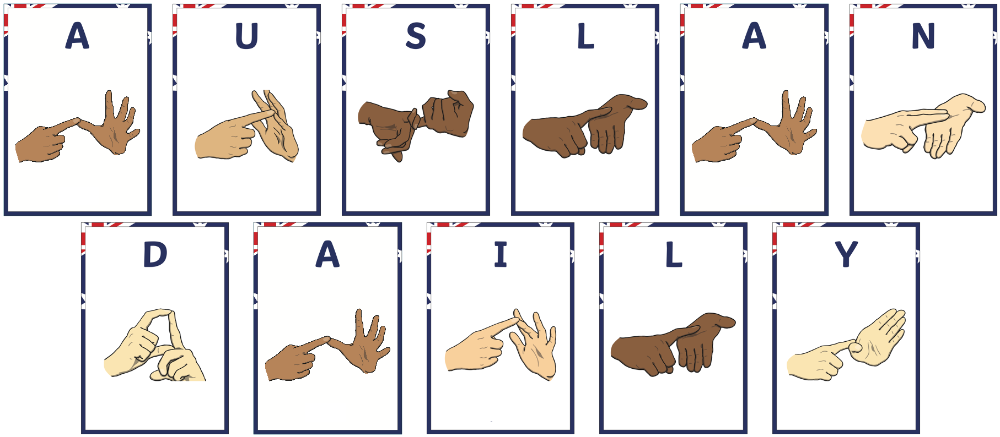

<!-- 
<head>
    
</head>
<figure class="image-with-caption">
    
    <!-- <figcaption>Spatial Annotation</figcaption> -->
<!-- </figure> -->

**Sign language (SL)** is the primary way for deaf or people with hearing loss to express themselves. Similar to various spoken languages, sign languages have their vocabularies and grammar. More importantly, diverse geographic regions usually have their native sign languages even though these regions share a commonly spoken language, such as America, Australia and the UK. To eliminate the communication barriers between the deaf and hearing communities, sign language translation (SLT) has been proposed to convert signs into spoken languages.

With the emerging deep learning techniques and large-scale sign language datasets, SLT has achieved promising progress recently. Researchers from various countries have constructed their sign language datasets and thus thrust SLT in their respective sign languages, such as American sign language (ASL), British sign language (BSL), Chinese sign language (CSL) and Germany sign language (DGS).

**Auslan** is the sign language used by the majority of the Australian Deaf community. The term Auslan is a portmanteau of "Australian Sign Language", coined by Trevor Johnston in the 1980s, although the language itself is much older. Auslan is related to British Sign Language (BSL) and New Zealand Sign Language (NZSL); the three have descended from the same parent language, and together comprise the BANZSL language family. Auslan has also been influenced by Irish Sign Language (ISL) and more recently has borrowed signs from American Sign Language (ASL). As with other sign languages, Auslan's grammar and vocabulary is quite different from English. Its origin cannot be attributed to any individual; rather, it is a natural language that emerged spontaneously and has changed over time.

However, to the best of our knowledge, there is no publicly available large-scale Auslan dataset for continuous sign translation. According to the Hearing Care Industry Association, as of June 2015, one in six Australians had hearing loss affecting them and this proportion is expected to increase to one in four by 2050. Due to the societal inclusion and the regional nature of sign languages, Australian sign language (Auslan) datasets are inevitably and urgently needed in order to investigate automatic translation.

**Auslan-Daily** is the first large-scale Auslan translation dataset. It has two main features (1) the topics are diverse and signed by multiple signers, and (2) the scenes in our dataset are more complex. Auslan-Daily provides multi-grained annotations, enabling researchers to investigate a variety of tasks.

Our releasing this dataset will help bridge that gap and provide necessary data resources for creating more equitable and inclusive AI systems. In the rapidly advancing era of AI, it is of paramount importance to ensure that the needs and inclusion of the Australian deaf community are not overlooked.
