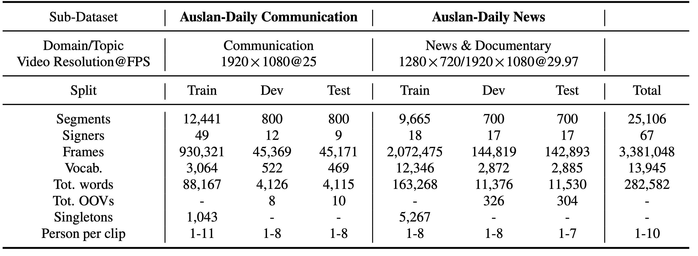
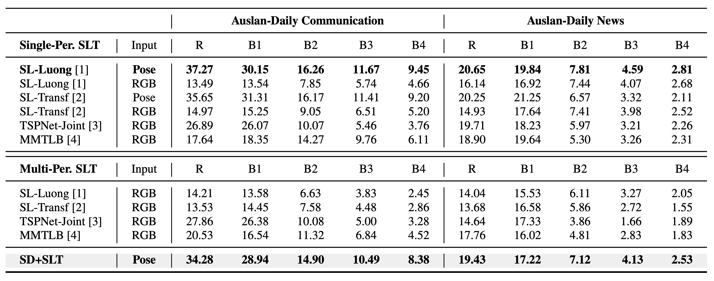

<head>
    
</head>

## Data Statistics of Auslan-Daily

<figure class="image-with-caption">
    
    <figcaption>Key statistics of Auslan-Daily. Auslan-Daily Communication and Auslan-Daily News are two sub-datasets split from Auslan-Daily. OOV: out-of-vocabulary. Singleton: words that only occur once in the training dataset.</figcaption>
</figure>

 
 

In Auslan-Daily, there are in total 25,106 video clips encompassing 67 unique signers, with the vocabulary size of 13,945 words. As the number of persons ranges from 1 to 10 in a video clip, the distractions, such as gesture interference of multi-persons, are also involved in sign language translation, thus imposing challenges in this task. 

 
 

## Benchmark of Auslan-Daily on Sign Language Translation

<figure class="image-with-caption">
    
    <figcaption>Translation results of Single-Person SLT and Multi-Person SLT models on Auslan-Daily.</figcaption>
</figure>

 
 

## Code

<ol style="margin-left: 50px;">
    <li>Effective Approaches to Attention-based Neural Machine Translation. <a href="https://github.com/neccam/slt">link</a> </li>
    <li>Sign Language Transformers: Sign Language Transformers: Joint End-to-end Sign Language Recognition and Translation. <a href="https://github.com/neccam/slt">link</a> </li>
    <li>TSPNet: Hierarchical Feature Learning via Temporal Semantic Pyramid for Sign Language Translation. <a href="https://github.com/verashira/TSPNet">link</a> </li>
    <li>A Simple Multi-Modality Transfer Learning Baseline for Sign Language Translation. <a href="https://github.com/FangyunWei/SLRT">link</a> </li>
</ol>
