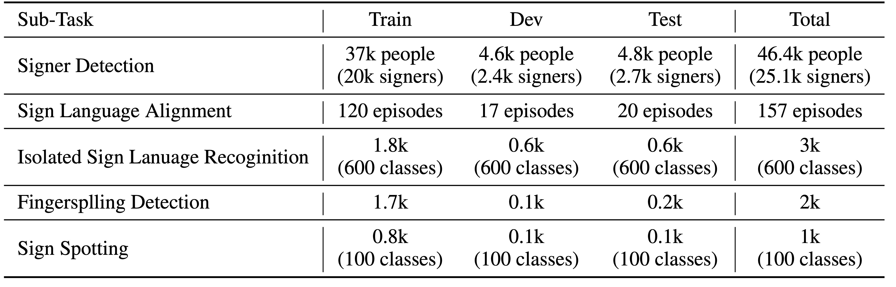

<head>
    
</head>

<figure class="image-with-caption">
    
    <figcaption> Data Split for Auslan-Daily Sub-Tasks. </figcaption>
</figure>

## Sub-Task of Auslan-Daily

<ul style="margin-left: 50px;">
    <li>Sign Language Alignment temporally aligns asynchronous subtitles in sign language videos. A proficient alignment model for sign language can mine more sign data for automated translation.</li>
    <li>Isolated Sign Language Recognition focuses on identifying  and understanding individual gestural signs, independent of any surrounding context or sequence of signs. </li>
    <li>Sign Spotting aims to find accurate locations of the given isolated signs  in continuous co-articulated sign language videos. </li>
    <li>Fingerspelling Detection finds  the fingerspelling segments’ intervals within the clip. Fingerspelling is an important component of Sign Language, in which words are signed letter by letter. </li>
    <li>Active Signer Detection aims to find the signer in the sign video clip. </li>
</ul>
