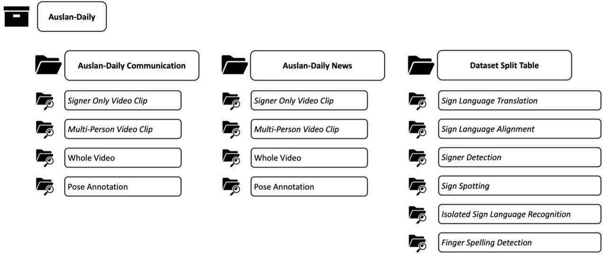

<!-- # Test

## Dataset Collection

### Step 1

### Step 2

### Step 3

## Annotations -->

## Dataset Format

  

The two sub-datasets are stored separately:

  > **Signer Only Video Clips:** the sign video clips with cropping the signer regions based on the ground-truth bounding-boxes of the signers. 

  > **Multi-Person Video Clips:** the sign video clips without cropping the acting signers.
  Whole Video: original video of each episode.

  > **Pose Annotation:** The pose sequences of all individuals in each sign video clip.

The dataset split for each task is stored in the Data Split Table file, please read the accompanying ReadMe.txt file carefully.

<!-- # Test 2 -->

## Download

[Google Drive Download Link](https://drive.google.com/drive/folders/17E5wgq1ig7-WynNskG-8tTMoOnGlVh4V?usp=sharing).

## Copyright:

Our dataset follows the copyright [Creative Commons BY-NC-ND 4.0 license](https://creativecommons.org/licenses/by-nc-nd/4.0/).
